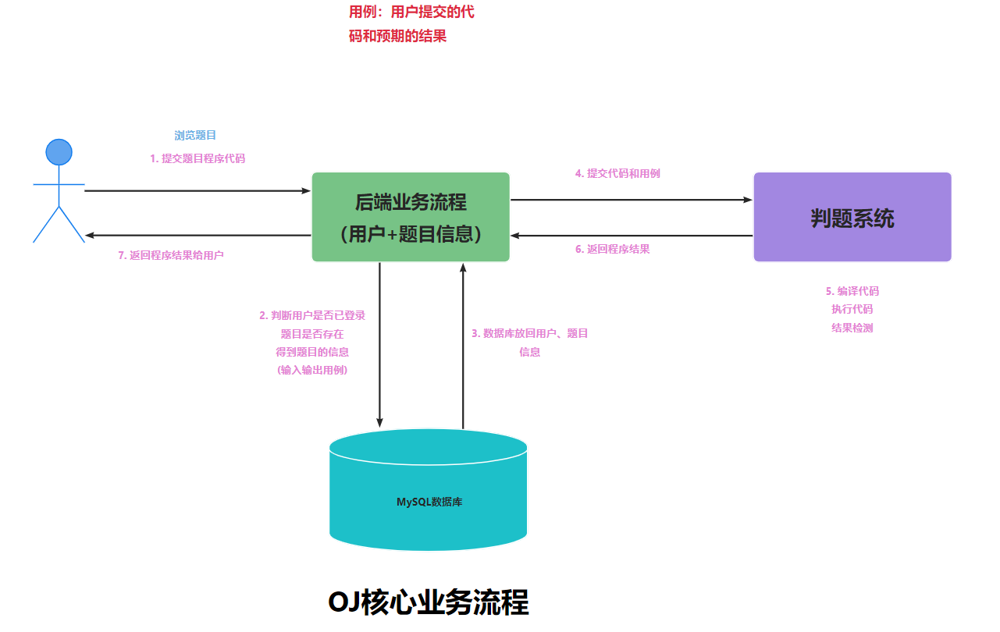
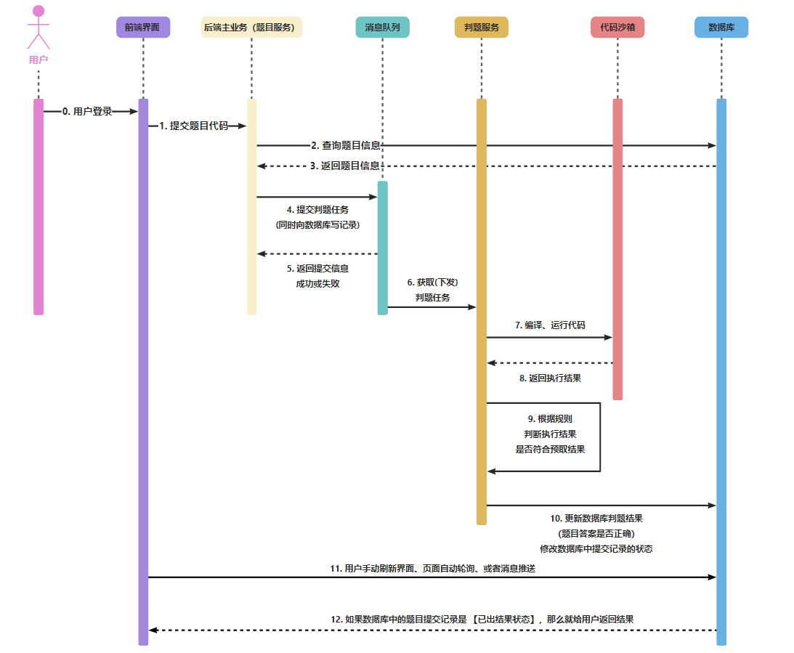

# 项目介绍
基于 Spring Boot + SpingCloud、Alibaba + ES + MyBatis-Plus + Redis + RabbitMQ + Docker 等技术实现的的
**编程算法题目在线评测系统**（简称OJ）。 HX OJ系统是一个在线算法评测系统，
用户可以选择题目、编写代码并提交代码进行评测，而且是高效、稳定的 OJ 在线判题评测系统，
它能够根据用户提交的代码、出题人预先设置的题目输入和输出用例，进行编译代码、运行代码、判断代码运行结果是否正确。

- 项目网页前端地址：https://github.com/hexinKing/hxoj-frontend-master
- 项目代码沙盒地址：https://github.com/hexinKing/hxoj-code-sandbox-master
- 项目微服务改造地址：https://github.com/hexinKing/heoj-backend-microservice

## 项目功能 

### 题目模块

1. 创建题目（管理员）
2. 删除题目（管理员）
3. 修改题目（管理员）
4. 搜索题目（用户/管理员）
5. 题目管理（管理员）
6. 在线做题（用户/管理）
7. 提交题目代码（用户/管理）
8. 消息队列：防止判题服务执行时间过长，并使用死信队列处理判题失败的题目，避免消息积压。

### 用户模块

1. 注册
2. 登录，在微服务中使用JWT Token实现登录，在网关层面获取token登录消息，实现用户鉴权
3. 用户管理（管理员）
4. 用户上传头像功能，使用阿里云对象存储OSS存储图片
5. 用户限流。本项目使用到令牌桶限流算法，使用Redisson实现简单且高效分布式限流，限制用户每秒只能调用一次提交一次题目，防止用户恶意占用系统资源

### 判题模块

1. 提交判题：结果是否正确与错误
2. 错误处理：内存益出、安全性、超时
3. 代码沙箱：执行代码，返回执行信息
4. 开放接口：提供一个独立的新服务

### 代码沙箱
- 只负责接受代码和输入，运行代码，返回编译运行的结果，不用管用户提交的程序是否正确(不负责判题)

### 项目核心亮点 ⭐

1. 权限校验：用户权限校验
2. 代码沙箱（安全沙箱）
    - 用户代码藏毒：写个木马文件、修改系统权限
    - 沙箱：隔离的、安全的环境，用户的代码不会影响到沙箱之外的系统的运行
    - 资源分配：限制用户程序的占用资源
3. 判题规则
    - 题目用例的比对，结果的验证
4. 任务调度（消息队列执行判题）
    - 服务器资源有限，用户要排队，按照顺序去依次执行判题

### 快速启动 

1. 下载/拉取本项目到本地
2. 通过 IDEA 代码编辑器进行打开项目，等待依赖的下载
3. 修改配置文件 `application.yaml` 的信息，比如数据库、Redis、RabbitMQ等
4. 修改信息完成后，通过 `ShierApplication` 程序进行运行项目

### 单体项目目录结构

```
├─sql  // 项目的SQL文件：创建数据库和数据表
├─src
   ├─main
      ├─java
      │  └─com
      │      └─shieroj
      │          ├─annotation // 权限控制
      │          ├─aop    //AOP切面
      │          ├─common // 通用类
      │          ├─config // 项目配置
      │          ├─constant // 项目常量
      │          ├─controller // 前端请求
      │          ├─exception  // 项目异常
      │          ├─judge      // 判题服务
      │          │  ├─codesandbox  // 代码沙箱
      │          │  │  ├─impl
      │          │  │  └─model
      │          │  └─strategy
      │          ├─manager  // 管理
      │          ├─mapper   // 数据访问（操作数据库）
      │          ├─model    // 项目实体
      │          │  ├─dto
      │          │  │  ├─file
      │          │  │  ├─question
      │          │  │  ├─questionsumbit
      │          │  │  └─user
      │          │  ├─entity
      │          │  ├─enums
      │          │  └─vo
      │          ├─mq      // 消息队列
      │          ├─service // 项目服务
      │          │  └─impl
      │          └─utils   // 项目工具
      └─resources // 项目资源配置
          └─mapper
```

### 架构设计

## 1、核心业务流程图


## 2、时序图


## 3、架构设计图

